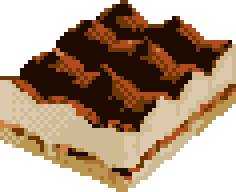

[](https://www.python.org/downloads/release/python-390/) 
[](https://zenodo.org/badge/latestdoi/242668685) 


<p align="center">
  
</p>

# 🔥 Better Tiramisu for PyTorch 🔥

Implementation of the Tiramisu Neural network for PyTorch with new features such as:

* Memory-efficient version (trade-off between memory and speed).
* Different types of upsampling (transposed convolution, upsampling and pixel shuffle).
* Different types of pooling (max-pooling, avg-pooling, blur-pooling).
* The depth and width of the Tiramisu is fully configurable.
* Early-transition can be enabled when the input images are big.
* The activation functions of all layers can be modified to something trendier.
* 🎉 Won a competition (Adipocyte Cell Imaging Challenge)! [Preprint of the winners is here](https://www.biorxiv.org/content/10.1101/2021.01.18.427121v3).

## Getting Started

The package can be installed from the repository with:

```console
> pip3 install git+https://github.com/npielawski/pytorch_tiramisu
```

You can try the model in Python with:

```py
from functools import partial
import torch
from torch import nn
from tiramisu import DenseUNet, DEFAULT_MODULE_BANK, ModuleName

module_bank = DEFAULT_MODULE_BANK.copy()
# Dropout
module_bank[ModuleName.DROPOUT] = partial(nn.Dropout2d, p=0.2, inplace=True)
# Every activation in the model is going to be a GELU (Gaussian Error Linear 
# Units function). GELU(x) = x * Φ(x)
# See: https://pytorch.org/docs/stable/generated/torch.nn.GELU.html
module_bank[ModuleName.ACTIVATION] = nn.GELU
# Example for segmentation:
module_bank[ModuleName.ACTIVATION_FINAL] = partial(nn.LogSoftmax, dim=1)
# Example for regression (default):
#module_bank[ModuleName.ACTIVATION_FINAL] = nn.Identity

model = DenseUNet(
    in_channels = 3,          # RGB images
    out_channels = 5,         # 5-channel output (5 classes)
    init_conv_filters = 48,   # Number of channels outputted by the 1st convolution
    structure = (
        [4, 4, 4, 4, 4],      # Down blocks
        4,                    # bottleneck layers
        [4, 4, 4, 4, 4],      # Up blocks
    ),
    growth_rate = 12,         # Growth rate of the DenseLayers
    compression = 1.0,        # No compression
    early_transition = False, # No early transition
    include_top = True,       # Includes last layer and activation
    checkpoint = False,       # No memory checkpointing
    module_bank = module_bank # Modules to use
)

# Initializes all the convolutional kernel weights.
model.initialize_kernels(nn.init.kaiming_uniform_, conv=True)
# Shows some information about the model.
model.summary()
```

This example tiramisu network has a depth of len(down_blocks) = 5, meaning that the
input images should be at least 32x32 pixels (i.e. 2^5=32).

## Documentation

The parameters of the constructor are explained as following:

* in_channels: The number of channels of the input image (e.g. 1 for grayscale, 3 for
  RGB).
* out_channels: The number of output channels (e.g. C for C classes).
* init_conv_filters: The number of filters in the very first convolution.
* structure: Divided in three parts (down blocks, bottleneck and up blocks) which
  describe the depth of the neural network (how many levels there are) and how many
  DenseLayers each of those levels have.
* growth_rate: Describes the size of each convolution in the DenseLayers. At each conv.
  the DenseLayer grows by this many channels.
* compression: The compression of the DenseLayers to reduce the memory footprint and
  computational complexity of the model.
* early_transition: Optimization where the input is downscaled by a factor of two after
  the first layer by using a down-transition (without skip-connection) early on.
* include_top: Including the top layer, with the last convolution and activation (True)
  or returns the embeddings for each pixel.
* checkpoint: Activates memory checkpointing, a memory efficient version of the
  Tiramisu. See: [https://arxiv.org/pdf/1707.06990.pdf](https://arxiv.org/pdf/1707.06990.pdf)
* module_bank: The bank of layers the Tiramisu uses to build itself. See next subsection
  for details.

### Module bank

The Tiramisu base layers (e.g. Conv2D, activation functions, etc.) can be set
to different types of layers. This was introduced to wrap many arguments of the
main class under the same object and increase the flexibility to change layers.

The layers that can be redefined are:

* CONV: Convolution operations in the full model. Change with care.
* CONV_INIT: Initial (1st) convolution operation. Note: Kernel size must be provided.
* CONV_FINAL: Final convolution. Will be set to a 1x1 kernel and reduce output to C
  classes.
* BATCHNORM: Batch normalization in the full model.
* POOLING: Pooling operation. Note: must reduce input size by a factor of two. If the
  size is odd, round *up* to the closest integer.
* DROPOUT: Dropout. The p value must be provided through partial.
* UPSAMPLE: Upsampling operation (must be by a factor of two)
* ACTIVATION: Activation function to use everywhere
* ACTIVATION_FINAL: Act. function at the last layer (e.g. softmax, nn.Identity)


Notes:

* For pooling common options are nn.MaxPool2d, nn.AvgPool2d, or even
  tiramisu.layers.blurpool.BlurPool2d.
* For upsampling, there are some presets: UPSAMPLE_NEAREST (default),
  UPSAMPLE_PIXELSHUFFLE, UPSAMPLE_TRANSPOSE (known to produce artifacts).
* The layers can be set to nn.Identity to be bypassed (e.g. if one wants to remove the
  dropout layer, or the final activation).
* The partial function can prefill some of the arguments to be used in the model.

## Tips and tricks

* Make sure the features you are interested in fit approximately the perceptive field.
For instance, if you have an object that measures 50 pixels, you need at approx. 6
levels of resolution in down/up blocks (since 2^6=64 > 50). Or use early transition,
which down samples the input by two.
* If you need to reduce the memory footprint, trying out the efficient version,
enabling the early transition is a great way to start. Then, using compression,
reducing the growth rate and finally the number of dense blocks in the down/up blocks.
* Use upsampling instead of transposed convolution, seriously. Transposed convolutions
are hard to manage and [may create a lot of gridding artefacts](https://distill.pub/2016/deconv-checkerboard/).
* Use blurpooling if you want the neural network to be shift-invariant (good accuracy
even when shifting the input).

## Built With

* [Pytorch](https://pytorch.org/) - Version >=1.4.0 (for memory efficient version)

## Contributing

See also the list of [contributors](https://github.com/npielawski/torch_tiramisu/contributors) who participated in this project.
For contributing, make sure the code passes the checks of [Pylama](https://github.com/klen/pylama), [Bandit](https://github.com/PyCQA/bandit) and [Mypy](https://github.com/python/mypy).
Additionally, the code is formatted with [Black](https://github.com/psf/black).

## License

This project is licensed under the MIT License - see the [LICENSE.md](LICENSE.md) file for details.

## Acknowledgments

Acknowledging and citing is appreciated and encouraged.

Zenodo record: [https://zenodo.org/record/3685491](https://zenodo.org/record/3685491)

Cite as:

```MLA
Nicolas Pielawski. (2020, February 24). npielawski/pytorch_tiramisu: Better Tiramisu 1.0 (Version 1.0). Zenodo. http://doi.org/10.5281/zenodo.3685491
```
